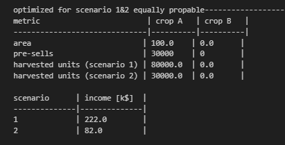

# [Ambiguity](https://www.linkedin.com/pulse/ambiguity-meinolf-sellmann-nefje/?trackingId=aUI8Uvl4R62uCOehVz26iQ%3D%3D)

| crop  | characteristic             | fix cost/acre  | penalty for shortfall |   |
|---    |---                         |---         |---                     |---|
| A     | optimized for wet weather  | $c_{f,A} = 150$ $       |  $s_A=1.50$ $/unit (not delivered)           |   |
| B     | optimized for dry weather  | $c_{f,B} = 100$ $       |  $s_B=1.45$ $/unit (not delivered)           |   |

- Total acres of land $A_{tot}=100$
- Pre-Sale Price (A & B) $p_{p,A}=p_{p,B}$ = $3.90 per unit sold.
- Minimum required income: $B_{min}$ $50,000

## scenarios

### Scenario 1 - wet summer

- Additional (variable) costs for crop A $c_{v,A,1}=50$ $/acre and we get (yield) $y_{A,1}=800$ units/acre at a marked prize of $p_{A,1}=2.50$ $.
- Additional (variable) costs for crop B $c_{v,B,1}=150$ $/acre and we get (only) (yield) $y_{B,1}=150$ units/acre at a market prize of $p_{B,1}=5$ $.

### Scenario 1 - dry summer

- Additional (variable) costs for crop A  $c_{v,A,2}=200$ $/acre and we get (only) (yield) $y_{A,2}=300$ units/acre at a marked prize of $p_{A,2}=4.50$ $.
- Additional (variable) costs for crop B $c_{v,B,2}=40$ $/acre and we get (yield) $y_{B,2}=600$ units/acre at a market prize of  $p_{B,2}=3$ $.

| $i$  | crop | var.cost [$/acre]   |  yield [units/acre] | prize [$]     |
|---   |---   |---                  |---                  |---            |
| 1    | A    |  $c_{v,A,1}=50$     |  $y_{A,1}=800$      | $p_{A,1}=2.50$ |
| 1    | B    |  $c_{v,B,1}=150$    |  $y_{B,1}=150$      | $p_{B,1}=5$ |
| 2    | A    |  $c_{v,A,2}=200$    |  $y_{A,2}=300$      | $p_{A,2}=4.50$ |
| 2    | B    |  $c_{v,B,2}=40$     |  $y_{B,2}=600$      | $p_{B,2}=3$ |

## Problem formulation

### descision variables
- planted area of crops: $A_A$, $A_B$ [arcre]
- pre-sold units of crops: $U_{p,A}$, $U_{p,B}$ [unit]

### fixed parameters:
- fix cost for planting: $c_{f,A}$ and $c_{f,B}$ [$]
- plenalty cost for shortfall: $s_A$ and $s_B$ [$/unit not delivered]
- pre sale prizes: $p_{p,A}$ and $p_{p,B}$ [$/unit]
- Total acres of land $A_{tot}$
- Minimum required income: $B_{min}$

### random/variable parameters (depending on scenario $i=1$ or $2$):
- variable cost/acre: $c_{v,A,i}$ and $c_{v,B},i$ [$/acre]
- yield: $y_{A,i}$ and $y_{B,i}$ [units/acre]
- selling prize: $p_{A,i}$ and $p_{B,i}$ [$]

### intermediate quantities
- harvested units: $H_{A,i} = y_{A,i} A_A$ and $H_{B,i} = y_{B,i} A_B$

### objectives:
- cost of planting: $C_{i}=-(c_{f,A}+c_{v,A,i}) A_A - (c_{f,B}+c_{v,B,i}) A_B $
- benefit: $B_{i}=\min(U_{p,A},H_{A,i}) p_{p,A} + \min(U_{p,B},H_{B,i}) p_{p,B} + \max(H_{A,i}-U_{p,A},0) p_{A,i} + \max(H_{A,i}-U_{p,B},0) p_{B,i}$
- penalty cost: $P_{i}=\min(H_{A,i}-U_{p,A},0) s_{A} + \min(H_{B,i}-U_{p,B},0) s_{B}$
- $\max J = \sum_{i=1}^2 (C_{i} + B_{i} + P_{i})$

### constraints
- $A_A+A_B=A_{tot}$
- $C_1+B_1+P_1>B_{min}$
- $C_2+B_2+P_2>B_{min}$

## solution

optimizing expected outcome (both scenarios equal probability)

