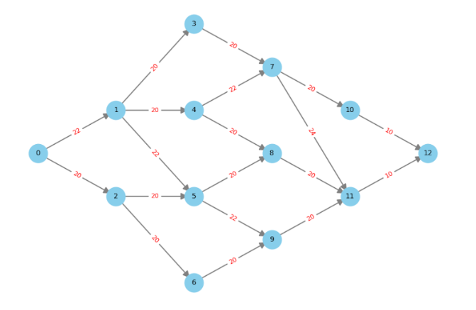

# [gambit - route planning](https://www.linkedin.com/pulse/gambit-meinolf-sellmann-ut4qe/?trackingId=RCrhSfRbQVuB9Fba3UEfYw%3D%3D)

- time limit: get to the airport in less than 95 minutes
- if the airport is not reached in <95 minutes, this will add additional 600$ cost (paying the next flight)
- if travel time to airport is > 86 minutes that will add additional 80$ cost (parking, below 86 minutes it is cheaper).
- a graph is available with
   - nodes: specific destinations (your home node 1, airport node 12, street crossings,..)
   - edges: streets connecting the nodes
   - weights on the edges give the current estimated travel time on the edge
   - travel times are subject of change of time

The network can be represented by a distance (travel time) matrix:
