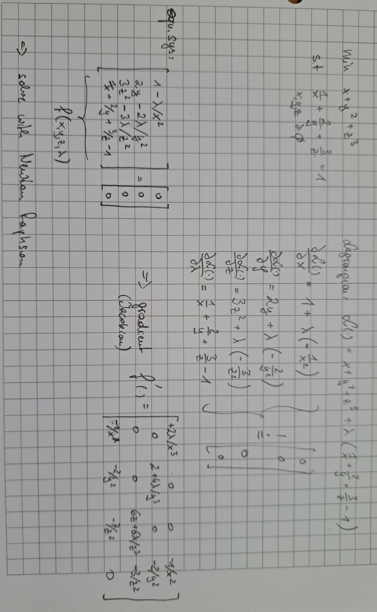

### Derivation




### Solution

use `solve_newton_raphson.m`:

```bash
>> solve_newton_raphson
iteration: 1
iteration: 2
iteration: 3
iteration: 4
iteration: 5
iteration: 6
iteration: 7
stopped
optimal solution:
x=19.73
y=7.30
z=4.44
lbd=389.26
cost function at optimum: 160.678
equality constraint: 1.000
```